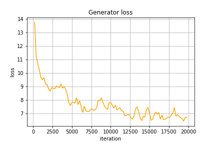
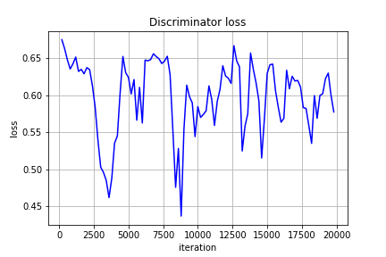
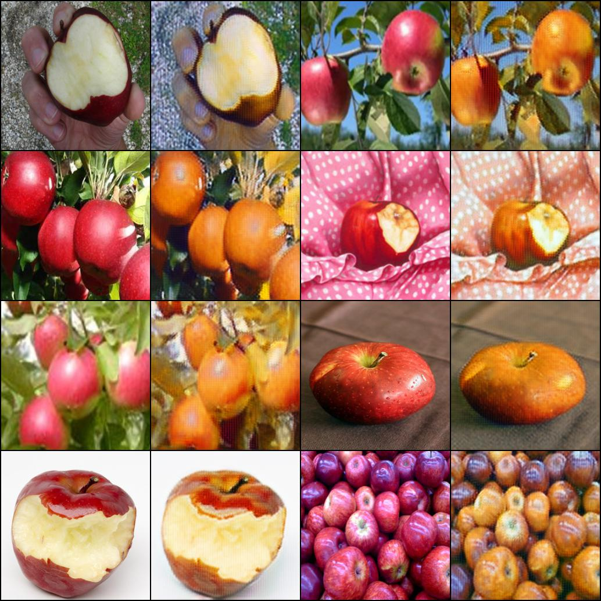
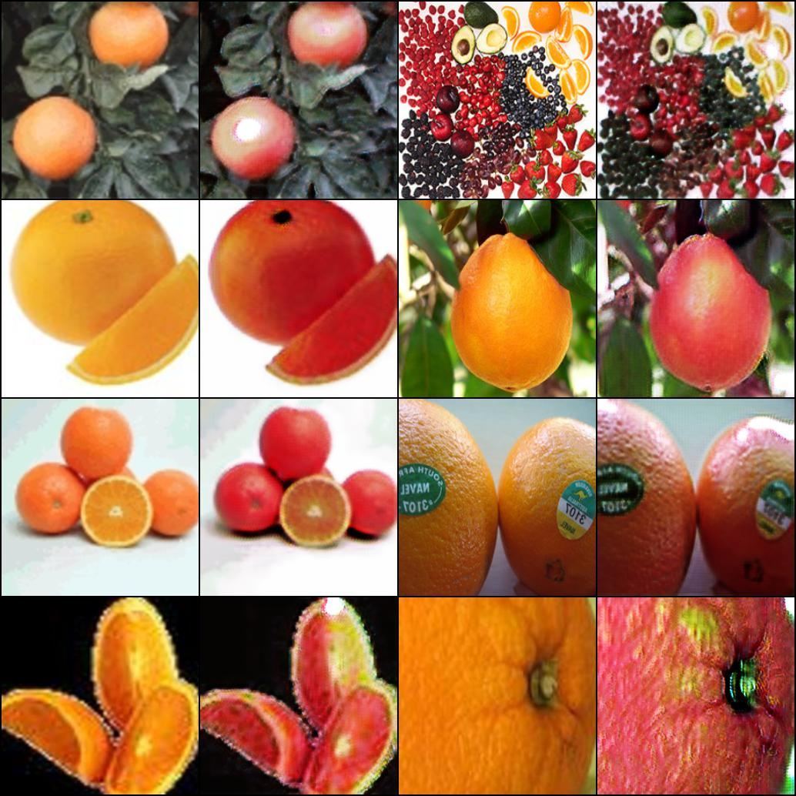

 CycleGAN
=========
Pytorch implementation of CycleGAN

:star: Star this project on GitHub — it helps!

[CycleGAN](https://arxiv.org/pdf/1703.10593.pdf) is a generative model which allows to
transfer the style of *image A* to *image B* and vice-versa. It does it by training two generators:
**Generator AB** and **GeneratorBA** as well as two discriminators: **Discriminator B** and **Discriminator A**.
As *Generators* it uses **U-Net**-like generators and **PatchGAN** discriminators.

## Table of content

- [Training](#train)
- [Results](#res)
- [License](#license)
- [Links](#links)

## Training 

See [demo](https://github.com/akanametov/CycleGAN/blob/main/demo/demo.ipynb) for more details of training process.
* The model trainer is under `trainer.py`.
### Results
##### `Generators` and `Discriminators` losses

<a>

    
    

</a>

#### Result on both Generators: from `A2B` and `B2A`

<a>

    
    

</a>

## License

This project is licensed under MIT.

## Links

* [CycleGAN](https://arxiv.org/pdf/1703.10593.pdf)
